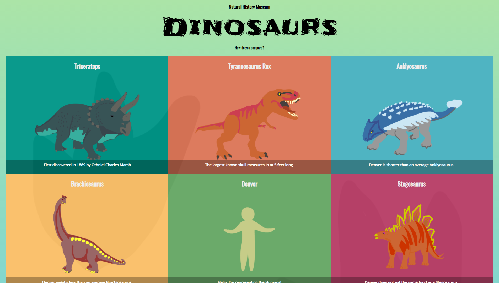

# Dinosaurs

> This project showcases object-oriented javascript and user interaction with the DOM by allowing users to compares dinosaur species to humans and displays random facts about the species1.

## Dinosaurs App

Visit the website [here](https://thepembeweb.github.io/dinosaurs/index.html)

## Installation

### Setup

* Clone the repo `git clone https://github.com/thepembeweb/dinosaurs.git`
* Open the index.html file in your browser to run the website

Alternatively you can view the website [here](https://thepembeweb.github.io/dinosaurs/index.html).

## Built With

* [HTML](https://en.wikipedia.org/wiki/HTML) - The markup language used
* [CSS](https://en.wikipedia.org/wiki/Cascading_Style_Sheets) - The style sheet language used
* [Javascript](https://en.wikipedia.org/wiki/JavaScript) - The programming language used
* [Wikipedia](https://www.wikipedia.org/) - The dinosaur data source used

## Authors

* **[Pemberai Sweto](https://github.com/thepembeweb)** - *Initial work* - [Dinosaurs](https://github.com/thepembeweb/dinosaurs)

## License

- This project is licensed under the MIT License - see the [LICENSE.md](LICENSE.md) file for details
- Copyright 2021 © [Pemberai Sweto](https://github.com/thepembeweb).

